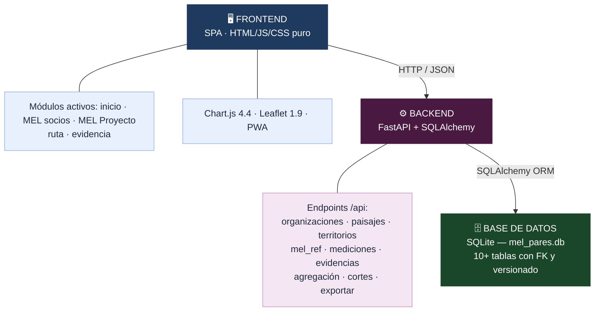
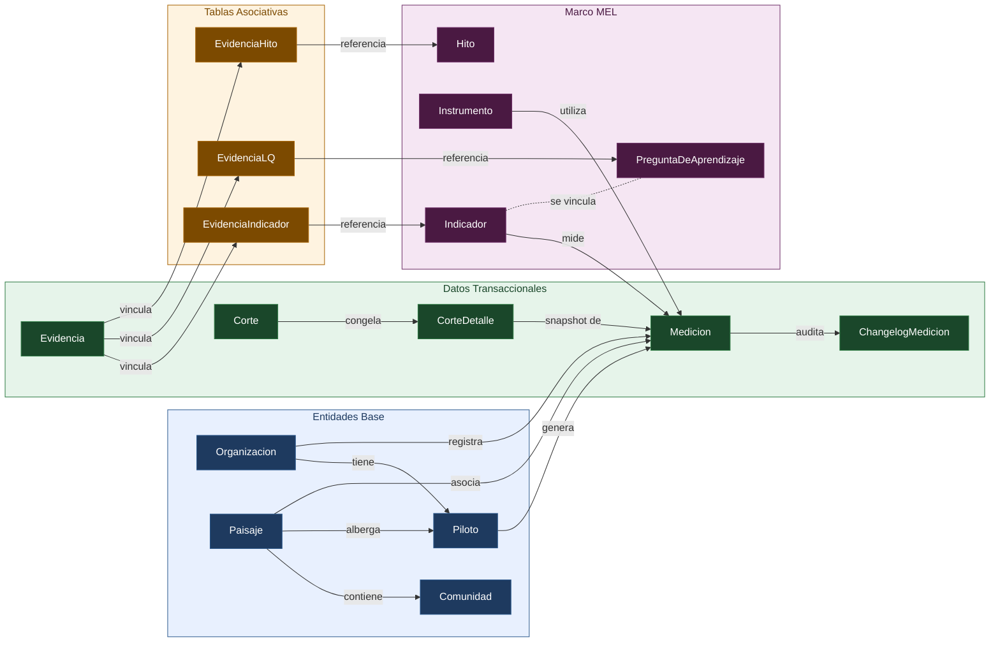

# MEL-PARES Dashboard

**Dashboard web para el Sistema de Monitoreo, Evaluación y Aprendizaje (MEL) del Proyecto PARES — CATIE.**

MEL-PARES es una aplicación web de página única (SPA) diseñada para centralizar la gestión de indicadores, mediciones, evidencias e hitos del Proyecto PARES. Permite a los equipos de campo y tomadores de decisión visualizar el progreso de intervenciones por organización, paisaje y piloto, mantener indicadores MEL y documentar evidencia con trazabilidad completa.

---

## 🏗️ Arquitectura del Sistema



### Stack Tecnológico

| Capa              | Tecnología                        | Versión        |
| ----------------- | --------------------------------- | -------------- |
| **Backend**       | Python + FastAPI                  | 3.9+ / 0.115.0 |
| **ORM**           | SQLAlchemy                        | 2.0.35         |
| **Base de datos** | SQLite                            | —              |
| **Validación**    | Pydantic                          | 2.9.0          |
| **Servidor ASGI** | Uvicorn                           | 0.30.0         |
| **Frontend**      | HTML5 + JavaScript ES6 + CSS3     | —              |
| **Gráficos**      | Chart.js                          | 4.4.0          |
| **Mapas**         | Leaflet                           | 1.9.4          |
| **Tipografía**    | Google Fonts (Oswald + Noto Sans) | —              |
| **Contenedores**  | Docker + Docker Compose           | —              |
| **PWA**           | Service Worker + Web App Manifest | —              |

---

## 📂 Estructura del Proyecto

```
MEL-PARES/
├── backend/
│   ├── main.py              # Punto de entrada: FastAPI, CORS, routers, archivos estáticos
│   ├── database.py          # Motor SQLAlchemy, sesión y PRAGMA foreign_keys
│   ├── seed.py              # Script de carga inicial de datos de referencia
│   ├── requirements.txt     # Dependencias Python
│   │
│   ├── models/              # Modelos SQLAlchemy (ORM)
│   │   ├── entidades.py     # Organizacion, Paisaje, Comunidad, Piloto
│   │   ├── mel.py           # Indicador, PreguntaDeAprendizaje, Instrumento, Hito
│   │   ├── medicion.py      # Medicion (registros de datos cuantitativos)
│   │   ├── evidencia.py     # Evidencia + tablas asociativas (indicador, LQ, hito)
│   │   ├── corte.py         # Corte y CorteDetalle (snapshots de reporte)
│   │   └── changelog.py     # ChangelogMedicion (log de cambios)
│   │
│   └── routes/              # Routers FastAPI
│       ├── organizaciones.py   # CRUD de organizaciones
│       ├── paisajes.py         # CRUD de paisajes
│       ├── territorios.py      # Gestión territorial (comunidades, pilotos)
│       ├── mel_ref.py          # Datos de referencia MEL (indicadores, LQs, instrumentos, hitos)
│       ├── mediciones.py       # CRUD de mediciones con changelog automático
│       ├── evidencias.py       # CRUD de evidencias con enlaces a indicador/LQ/hito
│       ├── agregacion.py       # Progreso por indicador y resumen general
│       ├── cortes.py           # Gestión de cortes (snapshots)
│       └── exportar.py         # Exportación HTML/PDF de reportes
│
├── frontend/
│   ├── index.html           # Shell principal de la SPA (sidebar + filtros + área dinámica)
│   ├── manifest.json        # Manifiesto PWA
│   ├── sw.js                # Service Worker para caché offline
│   ├── css/styles.css       # Estilos globales
│   ├── js/
│   │   ├── api.js           # Capa de comunicación con la API REST
│   │   └── app.js           # Router por hash, registro de módulos, filtros globales
│   ├── modules/
│   │   ├── inicio.js        # Pantalla de inicio con KPIs y semáforos
│   │   ├── mel-socios.js    # Indicadores MEL por organización socia
│   │   ├── mel-proyecto.js  # Indicadores MEL Proyecto desde MEL PROPOSAL V6.xlsx / Sheet1
│   │   ├── ruta.js          # Timeline de hitos del proyecto
│   │   └── evidencia.js     # Repositorio de evidencia filtrable
│   ├── icons/               # Íconos PWA
│   └── logos/               # Logos institucionales (EU, UNEP, CATIE)
│
├── Dockerfile               # Imagen Docker (Python 3.11-slim)
├── docker-compose.yml       # Orquestación con volumen persistente
└── brand.json               # Paleta de colores y branding institucional
```

---

## 🗄️ Modelo de Datos

El sistema administra 10 tablas principales organizadas en tres capas:

### Capa 1 — Entidades Base

Representan la estructura organizacional y geográfica del proyecto.

| Entidad          | Tabla            | Campos Clave                                                                       |
| ---------------- | ---------------- | ---------------------------------------------------------------------------------- |
| **Organizacion** | `organizaciones` | nombre, siglas, tipo (ONG/gobierno/academia), país                                 |
| **Paisaje**      | `paisajes`       | nombre, país, región, latitud, longitud                                            |
| **Comunidad**    | `comunidades`    | nombre, municipio → pertenece a un Paisaje                                         |
| **Piloto**       | `pilotos`        | nombre, estado (activo/completado/suspendido) → vinculado a Organización + Paisaje |

### Capa 2 — Marco MEL

Definen el marco de monitoreo, evaluación y aprendizaje.

| Entidad                   | Tabla                   | Campos Clave                                                     |
| ------------------------- | ----------------------- | ---------------------------------------------------------------- |
| **Indicador**             | `indicadores`           | código (O1, OC1…), tipo (output/outcome), unidad, baseline, meta |
| **PreguntaDeAprendizaje** | `preguntas_aprendizaje` | código (LQ1–LQ10), texto completo                                |
| **Instrumento**           | `instrumentos`          | nombre, tipo (encuesta, entrevista, pausa reflexiva…)            |
| **Hito**                  | `hitos`                 | nombre, fecha planificada, fecha real, estado, responsable       |

> Los indicadores y las preguntas de aprendizaje están vinculados mediante una tabla asociativa muchos-a-muchos (`indicador_lq`).

### Capa 3 — Datos Transaccionales

Registran mediciones, evidencia, snapshots y auditoría.

| Entidad               | Tabla                  | Campos Clave                                                                                  |
| --------------------- | ---------------------- | --------------------------------------------------------------------------------------------- |
| **Medicion**          | `mediciones`           | valor, fecha, unidad_de_análisis → FK a indicador, organización, paisaje, piloto, instrumento |
| **Evidencia**         | `evidencias`           | tipo (documento/foto/texto/video), archivo_url, texto, autor, tags                            |
| **Corte**             | `cortes`               | Snapshot de reporte por fecha con detalles de valores congelados                              |
| **ChangelogMedicion** | `changelog_mediciones` | valor_anterior, valor_nuevo, fecha_cambio, responsable                                        |

### Diagrama de Relaciones



---

## 🖥️ Módulos del Frontend

La aplicación frontend es una **SPA (Single Page Application)** que utiliza **ruteo por hash** (`#inicio`, `#indicadores`, etc.) y carga dinámicamente cada módulo. Incluye **filtros globales persistentes** (corte, paisaje, organización) que se aplican transversalmente a todas las vistas.

### 🏠 Inicio

Panel principal con KPIs de resumen: total de organizaciones, paisajes, pilotos, mediciones, evidencias e hitos. Muestra el avance general del proyecto con indicadores de semáforo.

### 📊 MEL socios

Vista de indicadores por organización socia con filtros y edición protegida para seguimiento de avances.

### 📊 MEL Proyecto

Vista de indicadores agregados del proyecto construida desde `MEL PROPOSAL V6.xlsx` / `Sheet1`. Muestra campos de fuente como instrumento de medición, evidencia, línea base, meta, avance, porcentaje, fuente de información, frecuencia, LQ y notas, con edición protegida para administradores.

### 🗓️ Ruta del Proyecto

Timeline visual de hitos del proyecto con estados (pendiente, en progreso, completado), fechas planificadas vs. reales y responsables asignados.

### 📁 Repositorio de Evidencia

Repositorio filtrable de evidencias (documentos, fotos, textos, videos) con filtros por indicador, pregunta de aprendizaje, organización, paisaje y piloto. Cada evidencia rastrea autor, fecha y tags.

---

## ⚙️ API REST

Todos los endpoints están bajo el prefijo `/api`. La API incluye documentación interactiva auto-generada en:

- **Swagger UI**: `http://localhost:8000/docs`
- **ReDoc**: `http://localhost:8000/redoc`

### Grupos de Endpoints

| Grupo              | Prefijo               | Descripción                                                              |
| ------------------ | --------------------- | ------------------------------------------------------------------------ |
| **Organizaciones** | `/api/organizaciones` | CRUD completo de organizaciones participantes                            |
| **Paisajes**       | `/api/paisajes`       | CRUD de paisajes geográficos                                             |
| **Territorios**    | `/api/territorios`    | Gestión de comunidades y pilotos por paisaje                             |
| **MEL Referencia** | `/api/mel`            | Indicadores, preguntas de aprendizaje, instrumentos e hitos              |
| **Mediciones**     | `/api/mediciones`     | CRUD de registros de datos cuantitativos (genera changelog automático)   |
| **Evidencias**     | `/api/evidencias`     | CRUD de evidencias con enlaces a indicadores, LQs e hitos                |
| **Agregación**     | `/api/agregacion`     | `GET /progreso` (cálculo de avance) y `GET /resumen` (conteos generales) |
| **Cortes**         | `/api/cortes`         | Gestión de snapshots (cortes de reporte por fecha)                       |
| **Exportar**       | `/api/exportar/pdf`   | Generación de reportes HTML imprimibles                                  |

---

## 📐 Reglas de Negocio

### Cálculo de Progreso

```
progreso = (actual - baseline) / (meta - baseline)
```

El resultado se acota al rango `[0, 1]`. Si el denominador es cero o negativo, el progreso se reporta como 0.

### Calidad de Evidencia

Se evalúa automáticamente con base en la triangulación de fuentes:

| Calidad      | Criterio                                                   |
| ------------ | ---------------------------------------------------------- |
| 🟢 **Alta**  | ≥ 2 instrumentos distintos **y** ≥ 2 evidencias vinculadas |
| 🟡 **Media** | ≥ 1 instrumento **o** ≥ 1 evidencia                        |
| 🔴 **Baja**  | Sin instrumentos ni evidencias registradas                 |

### Changelog Automático

Cada vez que se actualiza el valor de una medición, el sistema genera automáticamente un registro en `changelog_mediciones` con el valor anterior, el nuevo valor, fecha del cambio y responsable.

### Cortes de Reporte

Los cortes son snapshots que congelan los valores de las mediciones en una fecha determinada, permitiendo comparar el estado del proyecto entre diferentes periodos.

---

## 🚀 Instalación y Ejecución

### Requisitos

- Python 3.9+
- pip

### Instalación Local

```bash
cd backend
pip install -r requirements.txt
```

### Ejecución en Desarrollo

```bash
cd backend
uvicorn main:app --reload --port 8000
```

Abrir **http://localhost:8000** en el navegador. FastAPI sirve automáticamente el frontend como archivos estáticos.

### Carga de Datos Iniciales

```bash
cd backend
python seed.py
```

Esto puebla la base de datos con los indicadores, preguntas de aprendizaje, instrumentos e hitos de referencia del Proyecto PARES. Los indicadores MEL Proyecto se cargan desde `MEL PROPOSAL V6.xlsx`, usando exclusivamente la hoja `Sheet1`.

---

## 🐳 Despliegue con Docker

```bash
# Construir y levantar
docker-compose up -d --build

# Ver logs
docker-compose logs -f

# Detener
docker-compose down
```

El contenedor expone el puerto `8000` y utiliza un volumen persistente (`mel_pares_data`) para la base de datos SQLite, de modo que los datos sobreviven a reinicios del contenedor.

---

## 📱 PWA (Progressive Web App)

MEL-PARES es una PWA instalable en dispositivos móviles y de escritorio:

- **Manifest** (`manifest.json`): Define nombre, colores y orientación de la app.
- **Service Worker** (`sw.js`): Habilita caché para uso offline.
- **Responsive**: Layout adaptativo con hamburger menu para pantallas ≤ 900px.

---

## 🏢 Contexto del Proyecto

**Proyecto PARES** es una iniciativa del CATIE en el marco del **EU-UNEP Partnership**. El sistema MEL gestiona:

- **10 preguntas de aprendizaje** (LQ1–LQ10) que guían la reflexión estratégica.
- **Indicadores MEL Proyecto**: definidos por la hoja `Sheet1` de `MEL PROPOSAL V6.xlsx`.
- **Instrumentos activos**: encuestas pre/post individuales, encuesta organizacional, pausas reflexivas, sesiones de aprendizaje entre pares, entrevistas semiestructuradas, matrices de monitoreo y registros de campo.
- **Ventanas de medición**: alineadas a hitos como ToT1/ToT2 (2025), validación de hojas de ruta, sesiones CoP, visitas de verificación y encuentros interregionales.

---

## 📄 Licencia

Proyecto desarrollado para el CATIE como parte de la segunda consultoría del Proyecto PARES.
